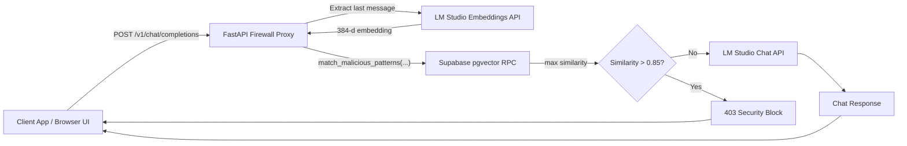

# LLM Semantic Firewall Proxy

A secure middleware for LLM applications that detects prompt-injection intent using semantic similarity instead of keyword matching. This project sits between a client and LM Studio. For every incoming chat request, it embeds the user prompt, checks similarity against malicious patterns in Supabase (pgvector), blocks high-risk prompts, and forwards safe requests to the local chat model.

Repository: [https://github.com/Shiva666666/Secure_LLM](https://github.com/Shiva666666/Secure_LLM)

## Architecture



## Features

- Semantic prompt-injection detection with vector similarity.
- OpenAI-compatible endpoint: `POST /v1/chat/completions`.
- Real-time streaming passthrough via SSE (`stream: true` support).
- Clean browser chat UI at `GET /`.
- Clear allow/block logging:
  - `[ALLOW] Score: 0.XX | Prompt: "..."`
  - `[BLOCK] Score: 0.XX | Prompt: "..."`

## Tech Stack

- **Backend:** FastAPI, Uvicorn
- **HTTP:** httpx (async + streaming)
- **Database client:** supabase-py
- **Config:** python-dotenv
- **Streaming:** sse-starlette (`EventSourceResponse`)
- **Vector DB:** Supabase PostgreSQL + pgvector
- **Local model runtime:** LM Studio (OpenAI-compatible API)

Dependencies are pinned in [`requirements.txt`](requirements.txt).

## Models Used

### 1) Embedding model (required)

- **Type:** BGE-small style embedding model
- **Dimension:** 384
- **Configured by:** `EMBEDDING_MODEL_NAME`
- **Example value:** `text-embedding-bge-small-en-v1.5`
- **Used in:** `POST {LM_STUDIO_URL}/embeddings`

Important: embeddings stored in Supabase must be generated with the same embedding model family/dimension used at runtime.

### 2) Chat model (required for responses)

- Any instruction-tuned chat model loaded in LM Studio (for example SmolLM-2 Instruct).
- This model serves `POST {LM_STUDIO_URL}/chat/completions`.
- The proxy does not hardcode a chat model name; it forwards the original request payload.

## API and Decision Logic

### Primary endpoint

- `POST /v1/chat/completions`

### Request processing flow

1. Parse request JSON and validate `messages`.
2. Extract text from the last message (`content` string, or first text part in multimodal list).
3. Generate prompt embedding from LM Studio embeddings API.
4. Call Supabase RPC:
   - `match_malicious_patterns(match_count, match_threshold, query_embedding)`
5. Compute maximum similarity from returned rows (`similarity` or `score` field).
6. Decision:
   - If `max_similarity > 0.85`: return `403` with:
     - `error: "Security Block: Adversarial intent detected."`
     - `similarity_score`
   - Else: forward request to LM Studio chat completions endpoint.

### Runtime constants

- `SIMILARITY_THRESHOLD = 0.85`
- `RPC_MATCH_COUNT = 20`
- `RPC_MATCH_THRESHOLD = 0.0`

## Project Structure

```text
.
├── main.py
├── requirements.txt
├── .env.example
├── .gitignore
└── static/
    └── index.html
```

## Step-by-Step Setup Guide

### 1) Clone/open project

```bash
git clone https://github.com/Shiva666666/Secure_LLM.git
cd Secure_LLM
```

### 2) Create Python environment (recommended)

```bash
python -m venv .venv
```

Activate:

- Windows (PowerShell): `.venv\Scripts\Activate.ps1`
- macOS/Linux: `source .venv/bin/activate`

### 3) Install dependencies

```bash
pip install -r requirements.txt
```

### 4) Prepare Supabase (pgvector + malicious patterns)

You need:

- A table storing malicious pattern text + embeddings (`vector(384)`).
- An RPC function named:
  - `match_malicious_patterns(match_count, match_threshold, query_embedding)`
- The RPC should return rows containing a similarity field (`similarity` or `score`).

Example RPC shape (adapt to your schema):

```sql
create or replace function match_malicious_patterns(
  match_count int,
  match_threshold float,
  query_embedding vector(384)
)
returns table (
  id bigint,
  pattern text,
  similarity float
)
language sql
as $$
  select
    id,
    pattern,
    1 - (embedding <=> query_embedding) as similarity
  from malicious_patterns
  where 1 - (embedding <=> query_embedding) > match_threshold
  order by similarity desc
  limit match_count;
$$;
```

### 5) Configure environment variables

Copy [`.env.example`](.env.example) to `.env` and set real values:

```env
SUPABASE_URL=https://your-project.supabase.co
SUPABASE_KEY=your-anon-or-service-role-key
LM_STUDIO_URL=http://127.0.0.1:1234/v1
EMBEDDING_MODEL_NAME=text-embedding-bge-small-en-v1.5
```

Notes:

- `LM_STUDIO_URL` must include `/v1`.
- Do not commit `.env`.

### 6) Start LM Studio local server

Load both:

1. Embedding model (384-d BGE-small variant)
2. Chat model (for assistant replies)

Ensure local server is reachable (typically `http://127.0.0.1:1234`).

### 7) Run the firewall proxy

```bash
uvicorn main:app --host 0.0.0.0 --port 8000
```

### 8) Test

- Browser UI: `http://localhost:8000`
- API docs: `http://localhost:8000/docs`
- API endpoint: `POST http://localhost:8000/v1/chat/completions`

## Example Behavior

### Blocked request

If a prompt is semantically similar to known malicious patterns:

```json
{
  "error": "Security Block: Adversarial intent detected.",
  "similarity_score": 0.91
}
```

### Allowed request

If similarity is below threshold, request is forwarded to LM Studio chat model and returns normal response.

## Troubleshooting

- **`LM Studio unavailable` / embeddings error**
  - Check LM Studio server is running.
  - Ensure `LM_STUDIO_URL` includes `/v1`.
  - Confirm embedding model is loaded.

- **Supabase RPC 404 (`PGRST202`)**
  - Verify function name is exactly `match_malicious_patterns`.
  - Ensure function signature includes:
    - `match_count`, `match_threshold`, `query_embedding`.
  - Check schema cache/permissions in Supabase.

- **Connection refused on `localhost:8000`**
  - Proxy is not running or wrong port.

- **No assistant response**
  - Chat model may not be loaded in LM Studio.

## Security Notes

- Never commit `.env` or real credentials.
- Prefer least-privileged keys in production.
- Rotate any key that was previously exposed.
- Consider adding rate limiting, auth, and monitoring for production use.

## Future Improvements

- Adaptive similarity threshold per use-case.
- Admin dashboard for blocked prompt analytics.
- Output-side safety checks.
- Conversation-level risk scoring (not only last message).
